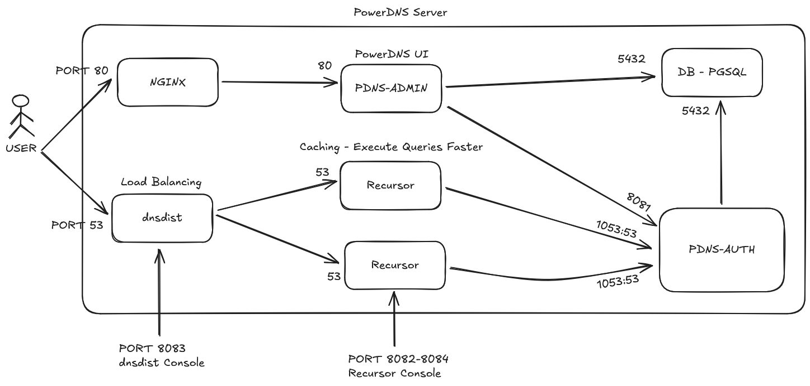
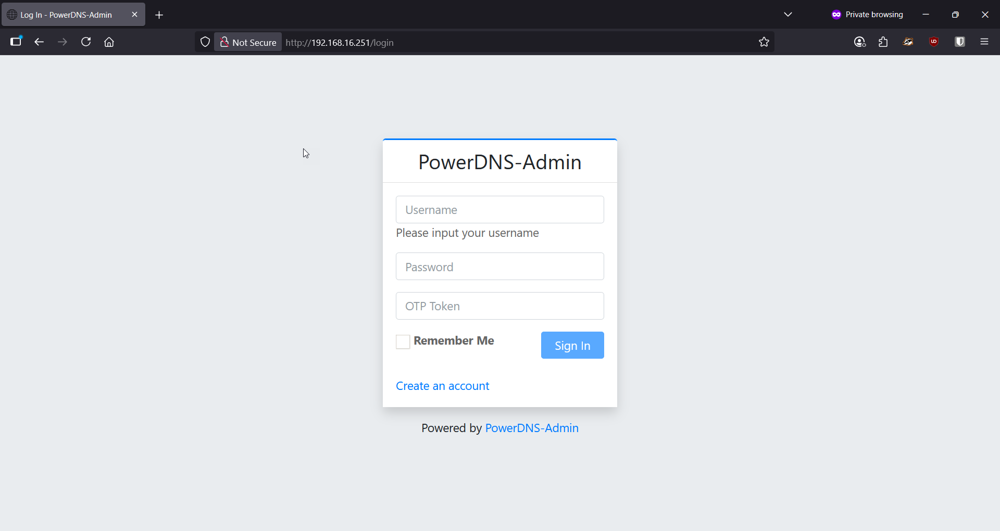

# PowerDNS (Dockerized)

The PowerDNS Authoritative Server is a versatile authoritative server for hosting domain names. It rapidly responds to recursive nameservers, helping hosters offer a high-performing authoritative service for their domain customers. PowerDNS Authoritative Server is flexible and highly scalable to serve individual needs and is the leading DNSSEC implementation used by many of the world's larger domain hosters.

<br>

> [!WARNING]
> ⚠️ **NOTE!!!!!** in this project we used these projects for [PoweDNS Authoritative Server](https://github.com/pschiffe/docker-pdns) and [PowerDNS Admin](https://github.com/PowerDNS-Admin/PowerDNS-Admin)

<br>

## Overview

PowerDNS Service Schema



## Prerequisites

1 - **[Docker](https://www.docker.com/)/[Podman](https://podman.io/)**

2 - **[Docker Compose](https://docs.docker.com/compose/)**

3 - **Docker Images**

- [Postgres](https://hub.docker.com/_/postgres)
- [pdns-pgsql](https://hub.docker.com/r/pschiffe/pdns-pgsql/)
- [pdns-recursor](powerdns/pdns-recursor-50:5.0.12)
- [dnsdist](https://hub.docker.com/r/powerdns/dnsdist-19)
- [NGINX](https://hub.docker.com/_/nginx)
- [PowerDNS-Admin](https://hub.docker.com/u/powerdnsadmin)

## Docker Compose

```yaml
services:
  db:
    image: postgres:15.14-alpine3.22
    container_name: postgres
    restart: always
    healthcheck:
      test: ["CMD-SHELL", "pg_isready -U ${POSTGRES_USER} -d ${POSTGRES_DB}"]
      interval: 10s
      timeout: 5s
      retries: 5
    environment:
      - POSTGRES_DB=${POSTGRES_DB}
      - POSTGRES_USER=${POSTGRES_USER}
      - POSTGRES_PASSWORD=${POSTGRES_PASSWORD}
    volumes:
      - pdns-data:/var/lib/postgresql/data
      # - ./pdns-schema.sql:/docker-entrypoint-initdb.d/schema.sql

  pdns-auth:
    image: pschiffe/pdns-pgsql:4.9-alpine
    container_name: pdns-auth
    restart: unless-stopped
    depends_on:
      db:
        condition: service_healthy
    environment:
      - PDNS_gpgsql_host=postgres
      - PDNS_gpgsql_port=5432
      - PDNS_gpgsql_user=${POSTGRES_USER}
      - PDNS_gpgsql_password=${POSTGRES_PASSWORD}
      - PDNS_gpgsql_dbname=${POSTGRES_DB}
      - PDNS_api=yes
      - PDNS_api_key=${PDNS_API_KEY}
      - PDNS_webserver=yes
      - PDNS_webserver_address=0.0.0.0
      - PDNS_webserver-allow-from=0.0.0.0/0
    ports:
      - "1053:53"
      - "1053:53/udp"
      # - "8081:8081"

  pdns-recursor-1:
    # image: powerdns/pdns-recursor-50:5.0.12
    image: powerdns/pdns-recursor-master:latest
    container_name: pdns-recursor-1
    restart: unless-stopped
    depends_on:
      db:
        condition: service_healthy
    environment:
      - PDNS_RECURSOR_API_KEY=${PDNS_RECURSOR_API_KEY}
    ports:
      # - "2053:53"
      # - "2053:53/udp"
      - "8082:8082"
    volumes:
      - ./recursor/recursor.conf:/etc/powerdns/recursor.conf
      - ./recursor/recursor.d/fz.yml:/etc/powerdns/recursor.d/fz.yml

  pdns-recursor-2:
    # image: powerdns/pdns-recursor-50:5.0.12
    image: powerdns/pdns-recursor-master:latest
    container_name: pdns-recursor-2
    restart: unless-stopped
    depends_on:
      db:
        condition: service_healthy
    environment:
      - PDNS_RECURSOR_API_KEY=${PDNS_RECURSOR_API_KEY}
    ports:
      # - "2053:53"
      # - "2053:53/udp"
      - "8084:8082"
    volumes:
      - ./recursor/recursor.conf:/etc/powerdns/recursor.conf
      - ./recursor/recursor.d/fz.yml:/etc/powerdns/recursor.d/fz.yml

  pdns-dnsdist:
    image: powerdns/dnsdist-19:1.9.11
    container_name: pdns-dnsdist
    restart: unless-stopped
    depends_on:
      db:
        condition: service_healthy
    environment:
      - DNSDIST_API_KEY=${DNSDIST_API_KEY}
    ports:
      - "53:53"
      - "53:53/udp"
      - "5199:5199"
      - "8083:8083"
    volumes:
      - ./dnsdist/dnsdist.conf:/etc/dnsdist/dnsdist.conf
      - ./dnsdist/dnsdist-resolver.lua:/etc/dnsdist/dnsdist-resolver.lua
    ulimits:
      nofile:
        soft: 1048576
        hard: 1048576

  nginx:
    # image: nginx:1.29-alpine3.22
    image: cgr.dev/chainguard/nginx:latest
    container_name: nginx
    restart: always
    ports:
      - "80:80"
      - "443:443"
    volumes:
      - ./nginx/conf.d:/etc/nginx/conf.d

  app:
    image: powerdnsadmin/pda-legacy:master
    container_name: powerdns_admin
    depends_on:
      db:
        condition: service_healthy
    restart: unless-stopped
    logging:
      driver: json-file
      options:
        max-size: 50m
    environment:
      - PDNS_ADMIN_SQLA_DB_TYPE=postgres
      - PDNS_ADMIN_SQLA_DB_HOST=postgres
      - PDNS_ADMIN_SQLA_DB_PORT=5432
      - PDNS_ADMIN_SQLA_DB_USER=${POSTGRES_USER}
      - PDNS_ADMIN_SQLA_DB_PASSWORD=${POSTGRES_PASSWORD}
      - PDNS_API_URL=http://pdns-auth:8081
      - PDNS_VERSION=4.9
      - PDNS_API_KEY=${PDNS_API_KEY}

volumes:
  pdns-data:
    driver: local
```

## NGINX Config

```conf
server {
    listen 80;

    location / {
        proxy_pass http://powerdns_admin:80;   # container name + internal port
        proxy_set_header Host $host;
        proxy_set_header X-Real-IP $remote_addr;
        proxy_set_header X-Forwarded-For $proxy_add_x_forwarded_for;
        proxy_set_header X-Forwarded-Proto $scheme;
    }
}
```

## Run

1 - Clone the Repo

```bash
git clone https://bit.behsacorp.com/scm/pdns/powerdns-dockerized.git
```

```bash
cd powerdns-dockerized
```

2 - Run with Docker Compose

```bash
docker compose up -d
```

3 - Open PowerDNS Admin Web UI



<p align="center">
  <picture>
    <source srcset="https://github-production-user-asset-6210df.s3.amazonaws.com/62666332/253642655-0438a9e1-d47d-4570-873c-5ddd59f46e9e.svg" width="100%" media="(prefers-color-scheme: light), (prefers-color-scheme: no-preference)" />
    <source srcset="https://github-production-user-asset-6210df.s3.amazonaws.com/62666332/253642655-0438a9e1-d47d-4570-873c-5ddd59f46e9e.svg" width="100%" media="(prefers-color-scheme: dark)" />
    
  </picture>
</p>
